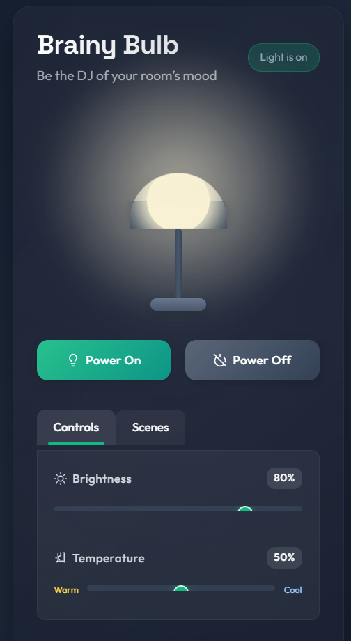

# 🧠💡 Brainy-Bulb



## Overview

Brainy-Bulb is an elegant IoT-based smart lighting system that demonstrates real-time control using the MQTT protocol. Experience the future of home automation with this interactive simulation of connected lighting technology.

## Features

- **Real-time Control**: Instantly toggle lights with zero perceptible delay
- **Status Monitoring**: Visual feedback showing current bulb state
- **MQTT Communication**: Industry-standard messaging protocol for IoT applications
- **Cross-platform**: Works across devices and operating systems

## System Architecture

Brainy-Bulb consists of two main components that communicate through a dedicated MQTT broker:

| Component | Purpose |
|-----------|---------|
| Web Interface | User-facing control panel to manage lighting |
| IoT Device Simulation | Python-based simulation of an ESP8266 microcontroller |

## Getting Started

### Prerequisites

- Python 3.6 or newer
- Modern web browser (Chrome, Firefox, Safari, Edge)
- Internet connection to access the MQTT broker
- Basic understanding of web technologies

### Installation

1. Clone this repository:
   ```bash
   git clone https://github.com/yourusername/brainy-bulb.git
   cd brainy-bulb
   ```

2. Install the required Python package:
   ```bash
   pip install paho-mqtt
   ```

### Running the System

1. **Start the IoT device simulation:**

   ```bash
   python light_simulation.py
   ```
   
   The terminal will display connection status and incoming commands.

2. **Launch the web interface:**

   Open `index.html` using Live Server in VS Code:
   - Install Live Server extension if you haven't already
   - Right-click on `index.html`
   - Select "Open with Live Server"
   
   

3. **Control your virtual smart bulb:**
   - Click the ON/OFF buttons to change the bulb state
   - Watch the status indicator update in real-time
   - Check the Python terminal to see the simulated device receiving commands

## Technical Details

### MQTT Configuration

- **Broker Address**: 157.173.101.159
- **Port**: 1883 (default MQTT port)
- **Topics**:
  - `home/light/command`: For sending commands to the light
  - `home/light/status`: For receiving status updates from the light

### Extending the Project

This simulation provides a foundation for more advanced IoT projects. Consider these extensions:

- Add brightness control and color adjustment
- Implement user authentication
- Create scheduled lighting routines
- Add multiple simulated devices
- Develop a mobile application using frameworks like React Native

## Troubleshooting

- **Connection Issues**: Ensure the MQTT broker is accessible from your network
- **Command Failures**: Verify that both components are running and connected to the broker
- **Interface Not Updating**: Check browser console for potential JavaScript errors

## License

[MIT License](LICENSE) - Feel free to use, modify, and distribute this code for personal or commercial projects.

## Acknowledgments

- The MQTT community for developing an efficient IoT communication protocol
- All contributors who helped make Brainy-Bulb shine

Author: Nyumbayire Laurent
